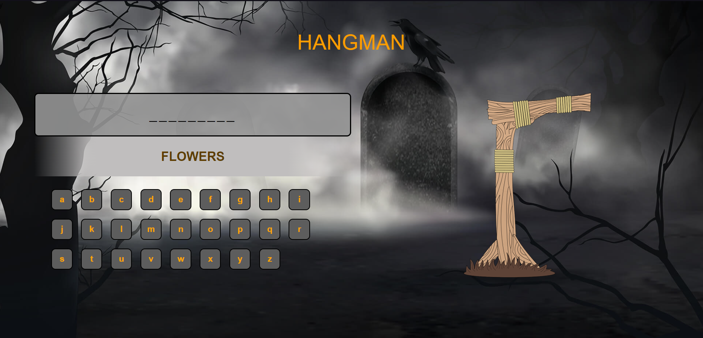
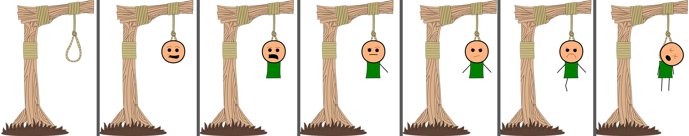

# Hangman in JavaScript

<h3>A simple hangman game made in JavaScript. The app contains 16 categories and 134 quotes.
The user has seven chances to guess the hidden quote, if he doesn't, he loses.
On the left side there is a keyboard, a quote category and a place for a quote. At the beginning, in place of the quote, the user will see an underscore "_", which indicates how many letters the quote has.</h3>

  

<h3>On the right is an image of a hangman  that changes when the user fails to guess the letter.</h3>

  

<h3>
When a user loses a game, they will see a hidden quote. If he wins, a congratulatory text will appear in place of the quote.</h3>
